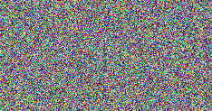

# bicubic-pytorch

Image resizing is one of the essential operations in computer vision and image processing.
While MATLAB's `imresize` function is used as a standard, implementations from other libraries (e.g., PIL, OpenCV, PyTorch, ...) are not consistent with the MATLAB, especially for a bicubic kernel.
The goal of this repository is to provide a **MATLAB-like bicubic interpolation** in a widely-used PyTorch framework.
Any issues are welcomed to make it better!


The merits of our implementation are:
* Easy to use. You only need one python file to copy.
* Consistent with MATLAB's `imresize('bicubic')`, with or without antialiasing.
* Support arbitrary resizing factors on different dimensions.
* Very fast, support GPU acceleration and batching.
* Fully differentiable with respect to input and output images.

## Updates

Previous version had some trouble with fractional scale factors (It was okay to select the output sizes which can result to fractional scale factors).
Version 1.2.0 fixes the issue and improves the accuracy.

## Environment and Dependency

This repository is tested under:
* Ubuntu 18.04
* PyTorch 1.5.1 (minimum 0.4.0 is required)
* CUDA 10.2
* MATLAB R2019b

However, we avoid using any version-dependent coding style to make our method compatible with various environments.
If you are not going to generate any test cases, MATLAB is not required.
You do not need any additional dependencies to use this repository.


## How to use

We provide two options to use this package in your project.
The first way is a Git submodule system, which helps you to keep track of important updates.
```bash
# In your project repository
$ git submodule add https://github.com/thstkdgus35/bicubic_pytorch

# To get an update
$ cd bicubic_pytorch
$ git pull origin
```

```python
# In your python code
import torch
from bicubic_pytorch import core

x = torch.randn(1, 3, 224, 224)
y = core.imresize(x, scale=0.5)
```

Otherwise, copy `core.py` from the repository as follows:

```python
import torch
from torch import cuda
import core

# We support 2, 3, and 4-dim Tensors
# (H x W, C x H x W, and B x C x H x W, respectively).
# Larger batch sizes are also supported.
x = torch.randn(1, 3, 456, 321)

# If the input is on a CUDA device, all computations will be done using the GPU.
if cuda.is_available():
    x = x.cuda()

# Resize by scale
x_resized_1 = core.imresize(x, scale=0.456)

# Resize by resolution (456, 321) -> (123, 456)
x_resized_2 = core.imresize(x, sizes=(123, 456))

# Resize without antialiasing (Not compatible with MATLAB)
x_resized_3 = core.imresize(x, scale=0.456, antialiasing=False)
```


## How to test

You can run `test.py` to check the consistency with MATLAB's `imresize`.

```bash
$ python test.py
```

You can generate more test cases using `test_answer/gen_test.m`.

```bash
$ cd test_answer
$ matlab -nodisplay < gen_test.m
```


## Automatic differentiation

Our implementation is fully differentiable.
We provide a test script to optimize a random noise Tensor `n` so that `imresize(n)` be a target image.
Please run `test_gradient.py` to test the example.

```bash
$ python test_gradient.py
```

You can check the input noise from `example/noise_input.png` and the optimized image from `example/noise_optimized.png`.




From the left, input noise, optimized, and target images.

## Acknowledgement

The repositories below have provided excellent insights.

* [https://github.com/fatheral/matlab_imresize](https://github.com/fatheral/matlab_imresize)
* [https://github.com/sefibk/KernelGAN](https://github.com/sefibk/KernelGAN)

## Citation

If you have found our implementation useful, please star and cite this repository:
```
@misc{son2020bicubic,
    author = {Son, Sanghyun},
    title = {bicubic-pytorch},
    year = {2020},
    publisher = {GitHub},
    journal = {GitHub repository},
    howpublished = {\usr{https://github.com/thstkdgus35/bicubic-pytorch}},
}
```
